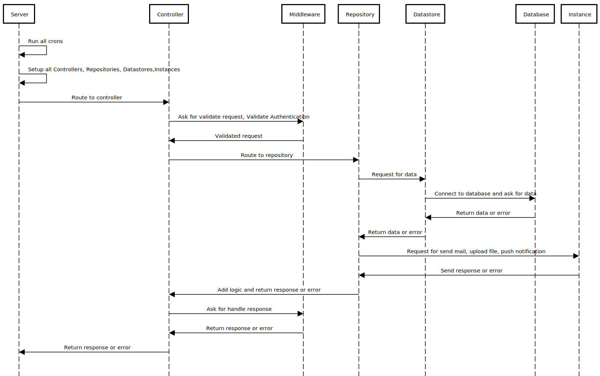

# backend Backend

## Project Structure

-----


### Requirements

-----

- npm `8.3.2`
- node `16.x`
- npm

### Setup

-----

```bash
npm install
```

#### Run

-----
You can run the development server by typing.

```bash
npm run start
```

### Commands

-----

- Formating code

```bash
npm run format
```

- Run testcases

```bash
npm run test
```


### Database access

-----
Ensure you have access to a SQL database when running locally.

The database host, port, credentials, etc are configured in the `src/config/Config.ts` file.

#### Database migrations

-----
The project is using [TypeORM](https://github.com/typeorm/typeorm) to generate automatic migration scripts based on the model changes.

To generate a migration, please use:

```bash
npm run typeorm -- migration:generate src/database/migrations/migration-name
```

**And then, import the migration to the following file: `/src/database/instances/DatabaseConnection`**

To migrate the changes you can use:

```bash
npm run typeorm -- migration:run
```

To migrate revert you can use:

```bash
npm run typeorm -- migration:revert
```

_You can find more information about how migrations work on TypeORM here: [https://github.com/typeorm/typeorm/blob/master/docs/migrations.md](https://github.com/typeorm/typeorm/blob/master/docs/migrations.md)_

### Commit rules

-----
Rules - <https://dev.to/intrepid_ishan/git-commit-message-convention-that-you-can-follow-1709>

commitlint - <https://www.npmjs.com/package/@commitlint/config-conventional>

### API docs

-----
Rules - <https://apidocjs.com/#param-api-sample-request>
